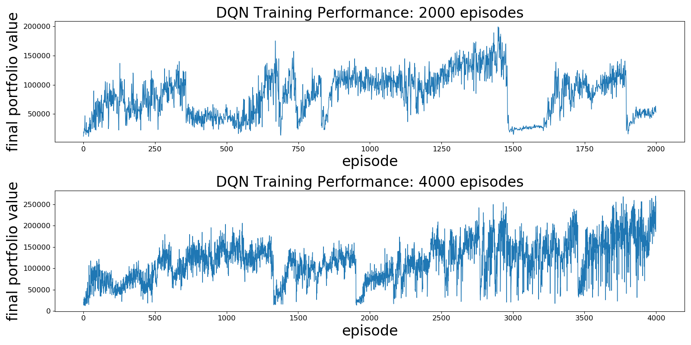

## Overview

This code is mainly inspired by [ShuaiW](https://github.com/ShuaiW/teach-machine-to-trade).

### Dependencies

Python 3.6
`pip install -r requirements.txt`

### Table of content

* `agent.py`: a Deep Q learning agent
* `envs.py`: a simple 3-stock trading environment
* `model.py`: a multi-layer perceptron as the function approximator
* `utils.py`: some utility functions
* `run.py`: train/test logic
* `requirement.txt`: all dependencies
* `data/`: the csv file of stock table and history close price of 19 stocks

### How to run

**To train a Deep Q agent**, run `python run.py --mode train`. There are other parameters and I encourage you look at the `run.py` script. After training, a trained model as well as the portfolio value history at episode end would be saved to disk.

**To test the model performance**, run `python run.py --mode test --weights <trained_model>`, where `<trained_model>` points to the local model weights file. Test data portfolio value history at episode end would be saved to disk.

abbreviation|para|default|usage
---|---|---|---
-e | --episode| default=2000 |number of episode to run
-b |--batch_size| default=32 |batch size for experience replay
-i |--initial_invest |default=20000 | initial investment amount
-m |--mode'| required=True |either "train" or "test"
-w |--weights| required when mode = "test" | a trained model weights

## Results

### Training for 2000 episodes and 4000 episodes

train：4000 episode

mean portfolio_val: 116988.378

median portfolio_val: 116565.0

### Old 19 stocks

test: 500 episode

mean portfolio_val: 17703.272

median portfolio_val: 16994.000000000004

### New 19 stocks

test: 500 episode

mean portfolio_val: 15256.06

median portfolio_val: 15008.0

